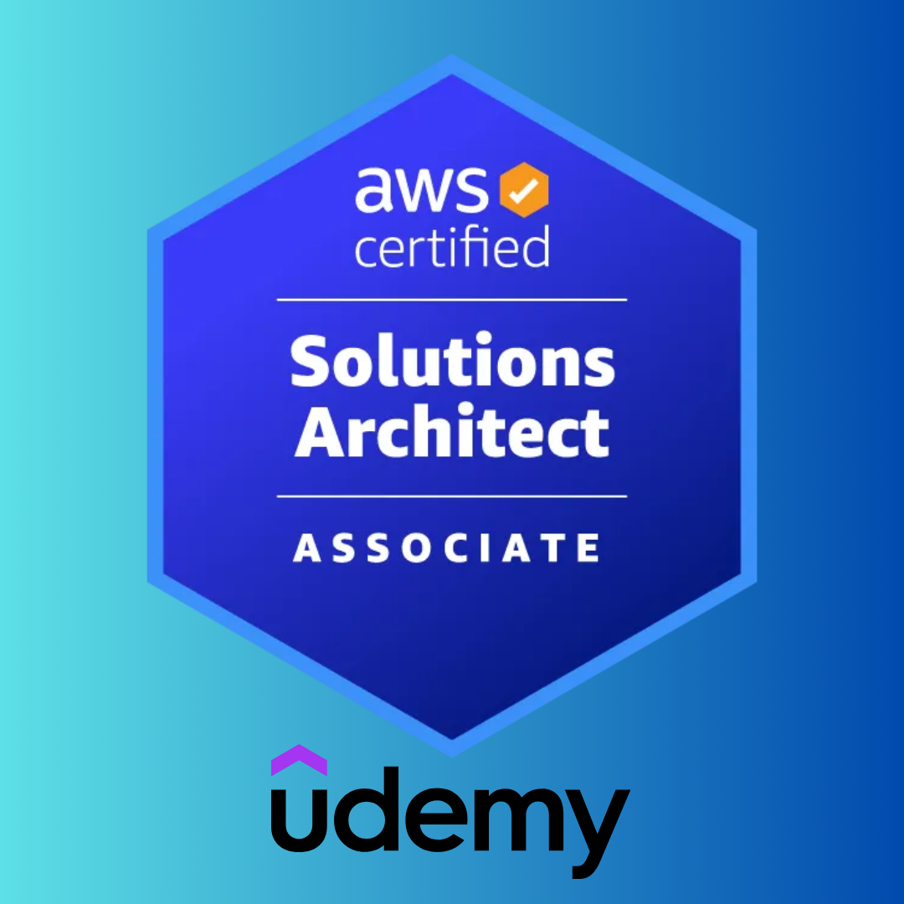

# 유데미 - 러닝 크루 2기

  
  
  
  

  

## 🎯 스터디 목표

- [Udemy - "AWS Certified Solutions Architect Associate 시험합격! 2025"](https://www.udemy.com/share/105HsY3@-Eq7TFAKPwVm6-0KDC3GH-fAUz9t_GWqpwEyejvo7Ch_s3vfFxIiQb3XQJg1ErMXOA==/) 완강 목표
- 스터디는 **온라인 조별** 진행 예정
- 스터디 당일 발표자를 선정하여 토론 및 학습 내용 공유
- **스터디 기간:** **총 8주 (2월 10일 ~ 4월 4일)**

**자세한 내용은 아래 위키를 참고하세요.**

## 📖 스터디 위키 링크

- [스터디 공지 사항](https://github.com/Udemy-kor/aws-saa/wiki/00-%EC%8A%A4%ED%84%B0%EB%94%94-%EA%B3%B5%EC%A7%80-%EC%82%AC%ED%95%AD)
- [스터디 규칙](https://github.com/Udemy-kor/aws-saa/wiki/01-%EC%8A%A4%ED%84%B0%EB%94%94-%EA%B7%9C%EC%B9%99)
- [스터디 목차](https://github.com/Udemy-kor/aws-saa/wiki/02-%ED%95%99%EC%8A%B5-%EB%AA%A9%EC%B0%A8)
- [스터디 CoC](https://github.com/Udemy-kor/aws-saa/wiki/03-%EC%8A%A4%ED%84%B0%EB%94%94-CoC)
- [학습 상세 목차](https://github.com/Udemy-kor/aws-saa/wiki/04-%ED%95%99%EC%8A%B5-%EC%83%81%EC%84%B8-%EB%AA%A9%EC%B0%A8)
- [스터디 관련 기록](https://github.com/Udemy-kor/aws-saa/wiki/05-%EC%8A%A4%ED%84%B0%EB%94%94-%EA%B4%80%EB%A0%A8-%EA%B8%B0%EB%A1%9D)

## 😀 스터디원 소개

  <table>
    <tr>
      <td align="center">
        <a href="https://github.com/abp1234">
          
           
          <b>abp1234(나경준)</b>
           
        </a>
         
        
         
        
      </td>
      <td align="center">
        <a href="https://github.com/boing-86">
          
           
          <b>boing-86(정보인)</b>
           
        </a>
         
        
         
        
      </td>
      <td align="center">
        <a href="https://github.com/ghktndyd">
          
           
          <b>ghktndyd(수용)</b>
           
        </a>
         
        
         
        
      </td>
      <td align="center">
        <a href="https://github.com/KR-CodingMonkey">
          
           
          <b>KR-CodingMonkey(재원)</b>
           
        </a>
         
        
         
        
      </td>
    </tr>
    <tr>
      <td align="center">
        <a href="https://github.com/kyungjunleeme">
          
           
          <b>kyungjunleeme(이경준)</b>
           
        </a>
         
        
         
        
      </td>
      <td align="center">
        <a href="https://github.com/nowij0">
          
           
          <b>nowij0(지원)</b>
           
        </a>
         
        
         
        
      </td>
      <td align="center">
        <a href="https://github.com/tiaz0128">
          
           
          <b>tiaz0128(주환석)</b>
           
        </a>
         
        
         
        
      </td>
      <td align="center">
        <a href="https://github.com/wch-os">
          
           
          <b>wch-os(선호)</b>
           
        </a>
         
        
         
        
      </td>
    </tr>
    <tr>
      <td align="center">
        <a href="https://github.com/zerofunc">
          
           
          <b>zerofunc(형주)</b>
           
        </a>
         
        
         
        
      </td>
    </tr>
  </table>

## 👥 조 편성 결과

### A조 (월요일)

- ghktndyd (수용)
- zerofunc (형주)
- boing-86 (보인)
- tiaz0128 (주환석)

### B조 (토요일)

- abp1234 (나경준)
- nowij0 (지원)
- wch-os (선호)
- kyungjunleeme(이경준)

## 📅 스터디 진행 사항

| 이름 | 1주차 | 2주차 | 3주차 | 4주차 | 5주차 | 6주차 | 7주차 | 8주차 |
| --- | --- | --- | --- | --- | --- | --- | --- | --- |
| abp1234(나경준) |  |  |  |  |  |  |  |  |
| boing-86(정보인) |  |  |  |  |  |  |  |  |
| ghktndyd(수용) |  |  |  |  |  |  |  |  |
| kyungjunleeme(이경준) |  |  |  |  |  |  |  |  |
| nowij0(지원) |  |  |  |  |  |  |  |  |
| tiaz0128(주환석) |  |  |  |  |  |  |  |  |
| wch-os(선호) |  |  |  |  |  |  |  |  |
| zerofunc(형주) |  |  |  |  |  |  |  |  |

## 🔗 스터디 관련 링크

- [스터디 모집 공고(인프런)](https://www.inflearn.com/studies/1503667/aws-saa-%EA%B0%95%EC%9D%98-%EC%8A%A4%ED%84%B0%EB%94%94)
- [스터디 모집 폼](https://forms.gle/ZV7SaTR9BabdXkve6)
- [스터디 OT PPT 문서](https://gamma.app/docs/AWS-OT-j132g9hb3kvnixq)
- [스터디 추가 모집 공고(인프런)](https://www.inflearn.com/studies/1513119/aws-saa-%EC%8A%A4%ED%84%B0%EB%94%94)
