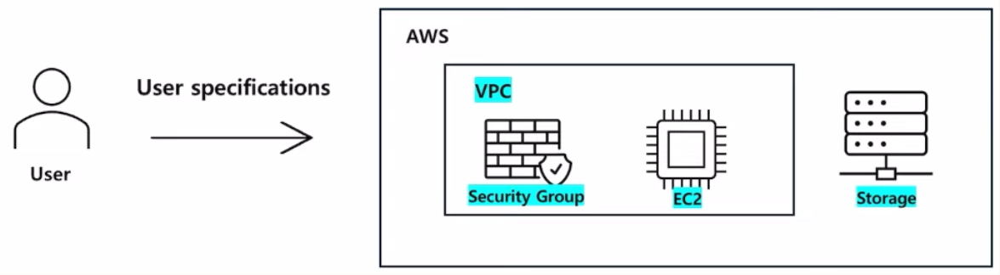
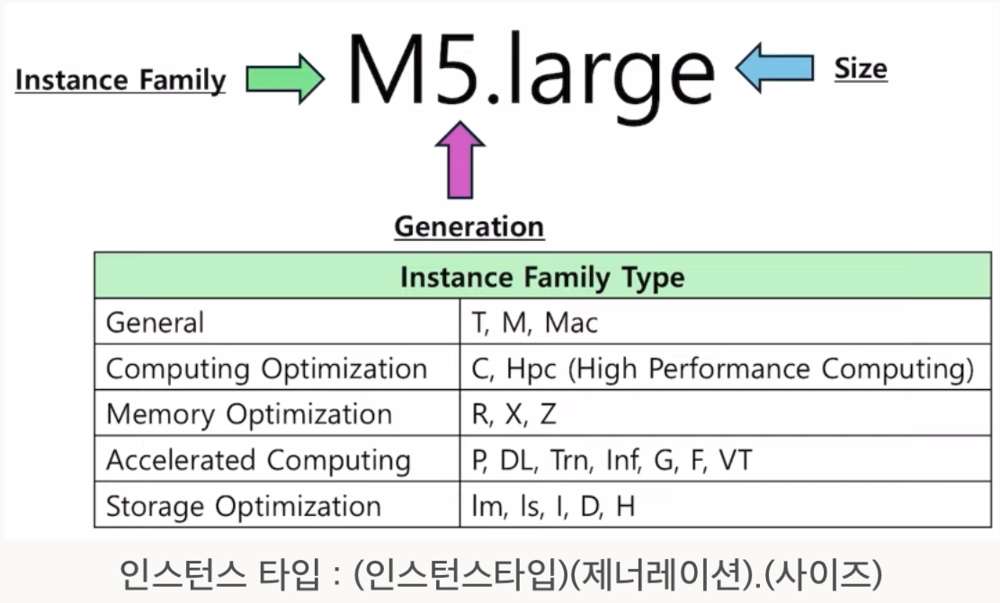
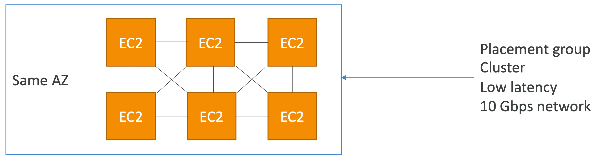
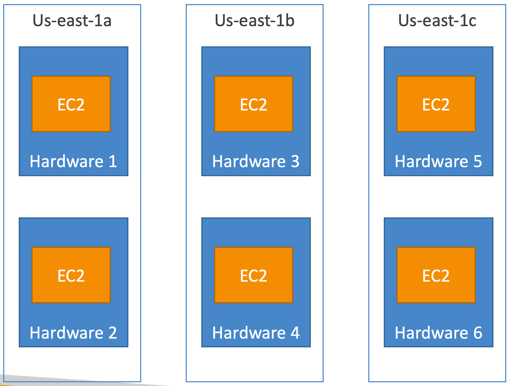
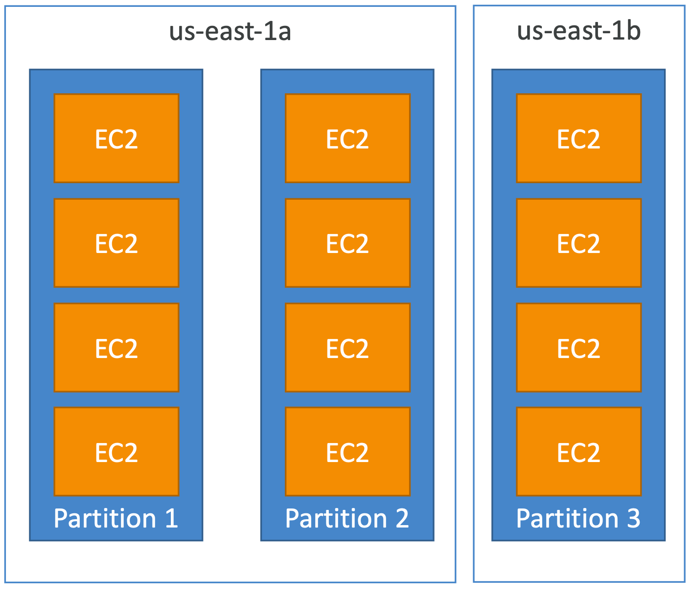

### IAM : *Identity and Access Management*

---

Global Service

#### 1. User/Group/Role
- User : 물리적 사용자와 매핑되며, AWS 콘솔에 대한 비밀번호를 가지고 있음
- Group : user(only)를 묶는 개념
- Role : EC2 인스턴스, AWS 서비스용 역할
- Policy : 사용자/그룹에 대한 권한을 기술하는 JSON 문서.
    - **버전**, 아이디, **statement**(sid, **effect, principle, action, resource**, condition) 로 구성되어 있음.
    - Least Privilege Principle 을 적용하는 것이 원칙

#### 2. IAM MFA
- Multi-Factor Authentication
- Virtual MFA Device : Google Authenticator, Authy
    - 장점 : 여러 토큰(AWS, 다른 곳들…) 을 하나의 디바이스에서 사용 가능하다
- Physical MFA Device : Universal 2nd Factor(U2F) Security Key : Yubikey(3rt party), Gemalto(3rt party), SurePassID for GovCloud

#### 3. Security Tools
- IAM Credentials Report (account-level) : 모든 user 계정과 자격 증명 상태에 대한 레포트를 제공
- IAM Access Advisor (user-level) : 사용자에게 승인된 서비스 권한을 보여줌.

+) Access Way : AWS Console, CLI, SDK

- CloudShell : 
    - 사용 불가능한 지역이 있으므로 확인 필요 (서울 가능)
    - aws 클라우드에서 사용가능한 터미널

#### 4. **Best Practice and Guidelines**
- aws 계정을 세팅하는 것을 제외하고 root account 를 사용하지 마십시오
- aws user 1개 계정 = 실제 사용자 1명 임을 명심하십시오
- 사용자를 group 에 할당하고, group 에 권한을 주어 관리하십시오
- 강력한 비밀번호 정책을 사용하십시오(MFA 등)
- AWS 서비스에 대해 Role 을 생성/사용하십시오
- IAM 유저, 액세스키를 절대 공유하지 마십시오

### EC2 : *Elastic Compute Cloud*

---

#### 1. **EC2 Basics**
- AWS Hypervisor 위에서 VM 을 사용
    

- EC2 인스턴스 타입에 대한 이해
    
    

#### 2. **Security Groups**
- 인스턴스, ENI(Elastic Network Interface) 를 위한 방화벽
- 인바운드 트래픽을 저장해놨다고 아웃바운드를 자동으로 허용함
- 최소 한 개 이상의 security group 이 있어야함. 차단은 없고 허용만 존재
- region, VPC 에 국한되어 있음. 다른 지역에서 run 하려면 다른 VPC를 만들어야함.

#### 3. **EC2 Purchasing Options**
- On-Demand : 사용량에 따라 가격이 책정
- Reserved : 1~3년치 비용을 먼저 지불. 온디맨드에 비해 72% 절약 가능
    - Convertible : EC2 타입, 패밀리, OS, 테넌시 등을 변경 가능. 66% 까지 절약 가능
- Saving Plans : 1~3년치 비용을 먼저 지불. 온디맨드에 비해 72% 절약 가능
    
    → Reserved 는 미리 인스턴스 패밀리, 사이즈를 선택, Saving Plans 는 여러 패밀리/사이즈를 선택할 수 있음
    
- Spot : 갑자기 종료될 수 있는 인스턴스. 90% 저렴
    - Spot Fleets : 스팟 인스턴스 묶음 + (optional) OnDemand 인스턴스
    - 최소가격, 용량최적화, 가격-용량 최적화 등의 전략을 취할 수 있음
- Dedicated 인스턴스 : Compliance, Security 요구사항이 있을 때 사용. Physical Machine 이 공유되지 않는다.  1시간에 2달러씩
- Dedicated Hosts : Phisical Server 공유되지 않음. 호스트별로 가격책정, Targeted region도 가능

#### 4. **EC2 심화 (with Network, Placement)**
- **EIP** : 고정 퍼블릭 주소. 
    - EC2 인스턴스에 할당할 수 있음. 
    - 일반적으로 EC2 public ip 는 재시작할 때마다 새로 할당되는데, EIP 를 사용하면 고정 ip 를 사용할 수 있음.

- **Placement Groups**
    - Cluster Placement Group : 인스턴스를 하나의 AZ에 배치하여 저지연 네트워크 성능을 제공. HPC 에 적합
        
    - Spread Plaement Group : 인스턴스를 서로 다른 AZ 에 분산하여 고가용성(안정성)을 제공, 중요한 워크로드 및 장애 최소화에 유용함
        - 단점 : 1개 AZ 당 7개 인스턴스가 최대. 사용가능한 az 갯수 * 7 이 최대
    
    - Partition Placement Group : 하나의 AZ, 서로 다른 rack 에 인스턴스를 분산, 파티션을 나눔. 데이터 손실 위험 및 장애 최소화 + 저지연 네트워크에 적합. HDFS, 카산드라, 카프카 등에 적합
        - 1개 AZ 당 7개 인스턴스가 최대, 수백개의 인스턴스 사용 가능
        - 각 인스턴스는 어떤 파티션에 속해있는지 메타데이터를 통해 확인 가능하다.
    

- **ENI : Elastic Network Interface**
    - AZ 에 종속되는 서비스
    - VPC 내에서 가상의 네트워크 카드 역할을 하는 논리적인 컴포넌트. EC2 와 연결하여 네트워크를 담당함
    - Primary private IPv4 + 추가 IPv4 제공, 각 private IPv4 당 하나의 EIP 연결 가능
    - Public IPv4 주소 지원 및 Security Group 적용 가능. 고유한 MAC 주소 보유
    - ENI 를 생성한 후, EC2 에 attach/detach 가능함 → 장애복구에서 편리!
    - 하나의 EC2 에서 여러 개 ENI 연결 가능함 → 멀티 서브넷, 여러 VPC 에 연결 가능함
    
- **EC2 Hibernate**
    - EC2 인스턴스 Stop/Terminate 할 수 있음. Stop 은 볼륨은 유지되며, terminate 는 완전히 삭제
        
        → 인스턴스를 다시 시작하려면 부팅+실행+로딩 이 필요함.
        
    - 최대 절전 모드는 Stop 과 비슷하지만 RAM 상태를 유지하여 부팅 없이 실행 가능하다
    - RAM 의 상태는 root EBS 에 파일로 저장(단, 암호화 필수), running 상태가 될 때, 이를 다시 복원하여 사용
    - 주의사항
        - 지원되는 인스턴스가 있음! - C3, C4, C5, I3, M3, M4, R3, R4, T2, T3 등 일부 EC2 인스턴스만 지원
        - 150GB 이하의 RAM을 가진 인스턴스만 Hibernate 가능
        - 특정 OS 만 지원 - Amazon Linux 2, Ubuntu, RHEL, CentOS, Windows 등
        - 루트 볼륨 조건 : EBS만 사용, 암호화 필수, 충분한 크기 필요
        - 최대 60일까지 가능